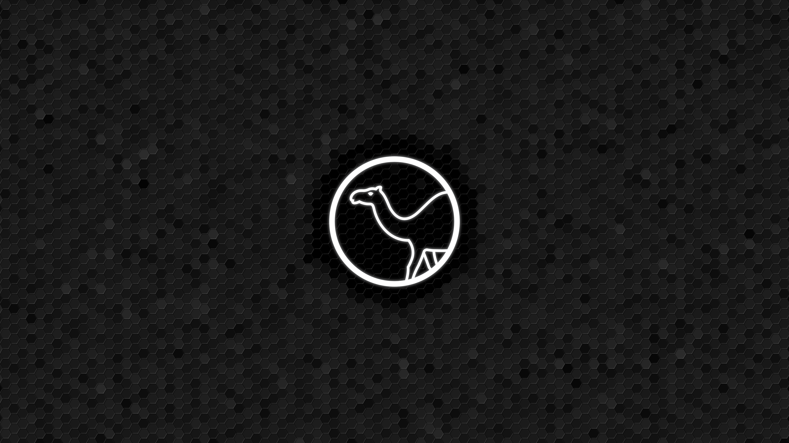

# Minimalistic Perl wallpapers

These are Perl-themed wallpapers using the new logo of the language.

## Pre-generated wallpapers

    
    
    
    

## Making your own wallpaper

Creating similar looking wallpaper should be easy to do. Open `source.xcf` with
GIMP and modify however you like.

### Author

Bartosz Jarzyna (bbrtj)

### License

These wallpapers are licensed under [CC-BY](https://creativecommons.org/licenses/by/4.0/).

The Perl logo used in these wallpapers is Copyright (c) 2024 Olaf Anders, also licensed under [CC-BY](https://creativecommons.org/licenses/by/4.0/).

